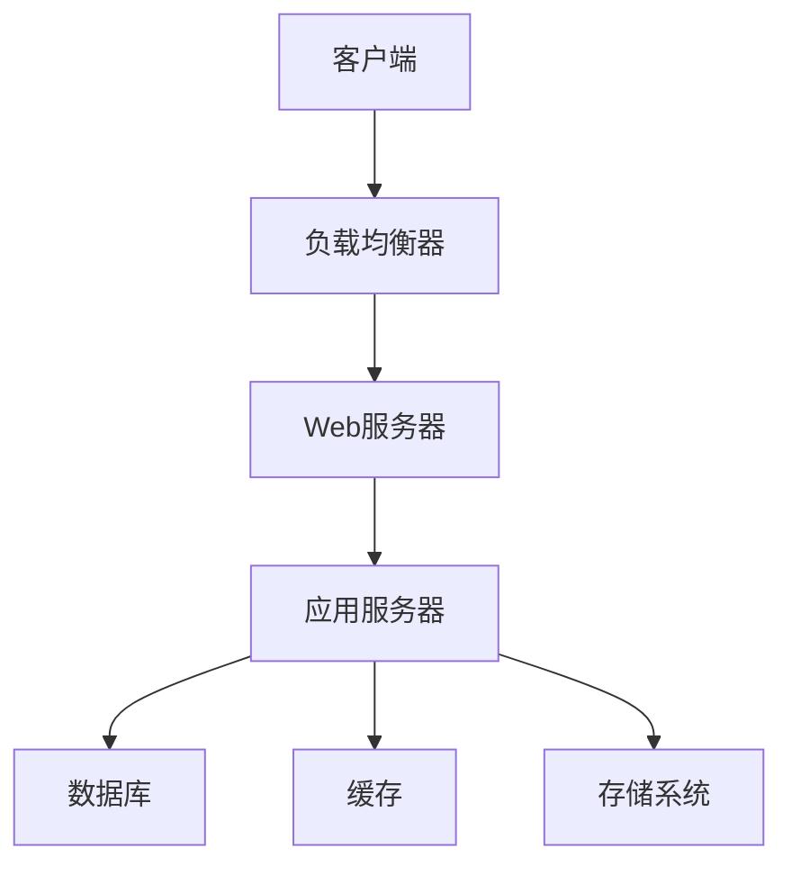
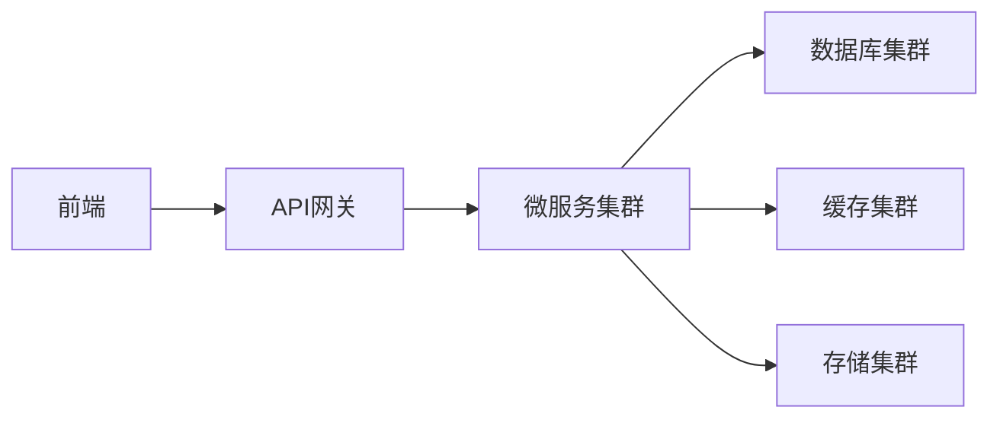
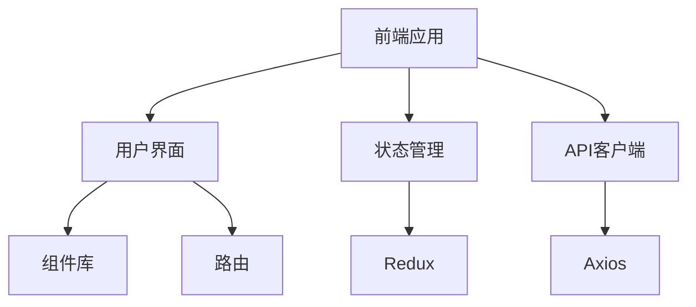
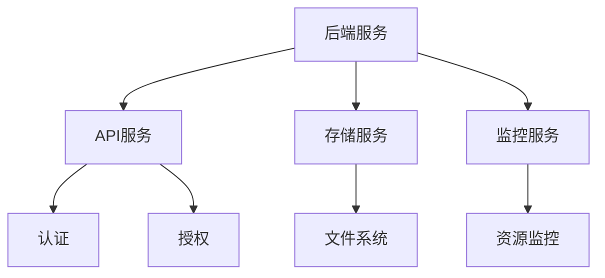
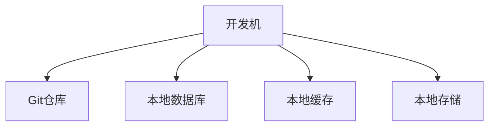
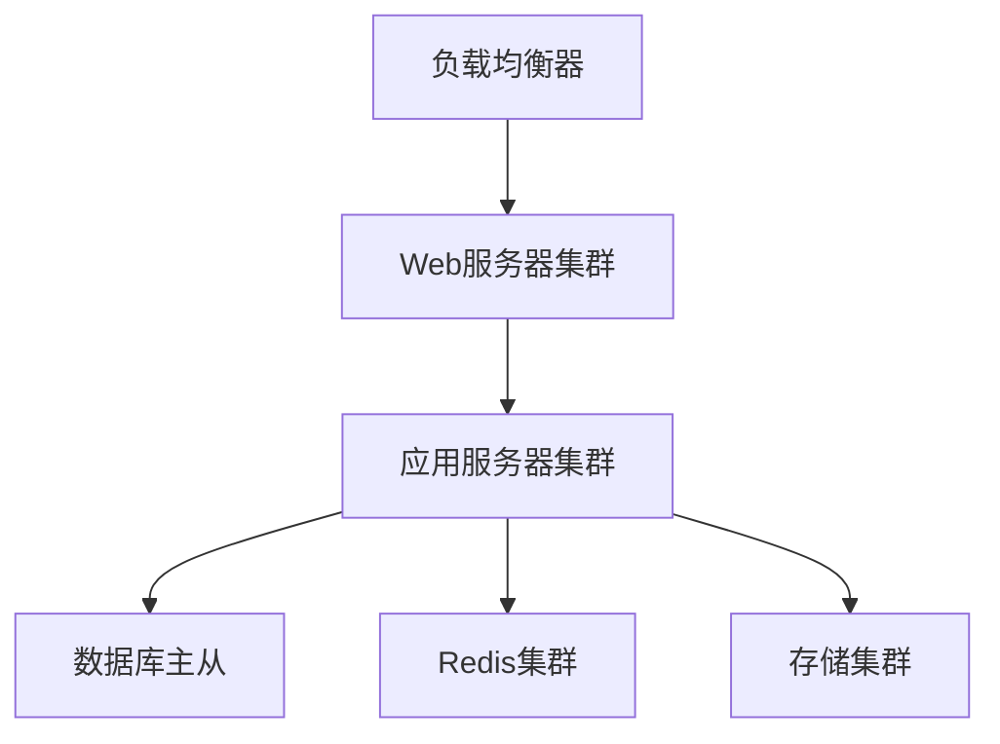
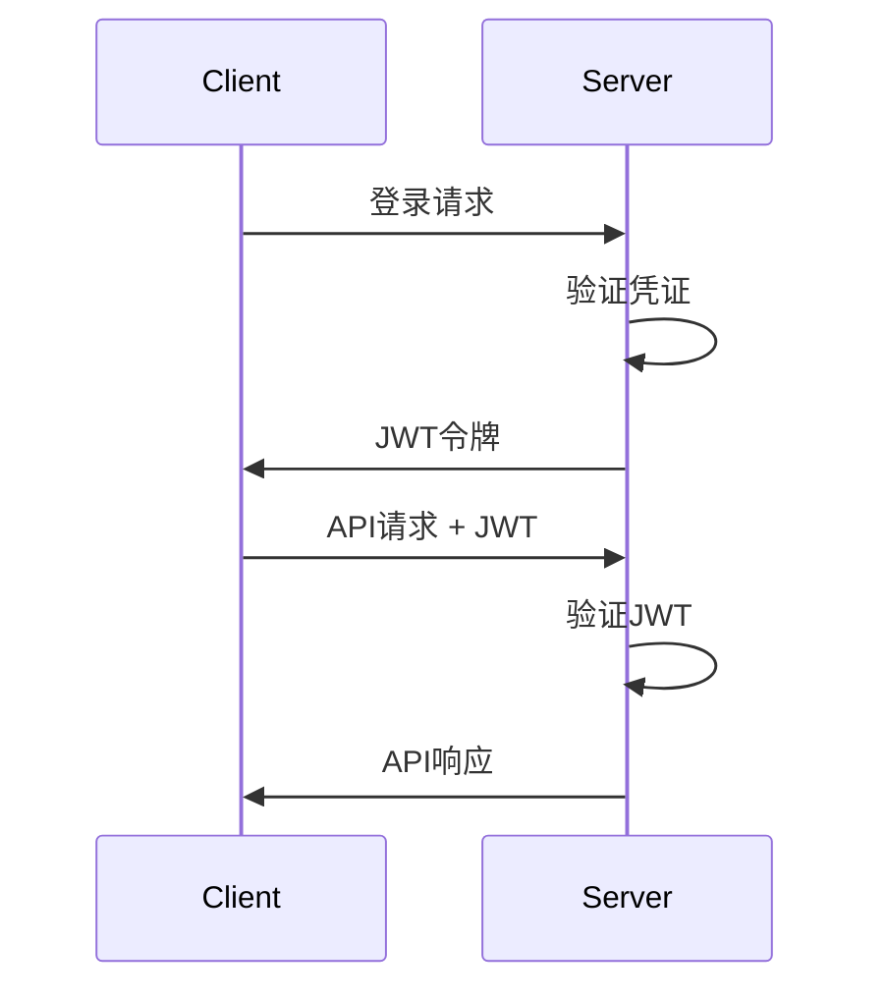

# NAS系统技术文档

## 1. 系统架构

### 1.1 整体架构


### 1.2 技术架构


## 2. 模块设计

### 2.1 前端模块


### 2.2 后端模块


## 3. 数据库设计

### 3.1 用户表
```sql
CREATE TABLE users (
    id SERIAL PRIMARY KEY,
    username VARCHAR(50) UNIQUE NOT NULL,
    password_hash VARCHAR(255) NOT NULL,
    email VARCHAR(100) UNIQUE NOT NULL,
    role VARCHAR(20) NOT NULL,
    created_at TIMESTAMP DEFAULT CURRENT_TIMESTAMP,
    updated_at TIMESTAMP DEFAULT CURRENT_TIMESTAMP
);
```

### 3.2 存储池表
```sql
CREATE TABLE storage_pools (
    id SERIAL PRIMARY KEY,
    name VARCHAR(50) NOT NULL,
    type VARCHAR(20) NOT NULL,
    status VARCHAR(20) NOT NULL,
    total_size BIGINT NOT NULL,
    used_size BIGINT NOT NULL,
    created_at TIMESTAMP DEFAULT CURRENT_TIMESTAMP,
    updated_at TIMESTAMP DEFAULT CURRENT_TIMESTAMP
);
```

## 4. API接口设计

### 4.1 用户认证
```typescript
// 登录接口
POST /api/auth/login
Request:
{
    username: string;
    password: string;
}
Response:
{
    token: string;
    user: {
        id: number;
        username: string;
        role: string;
    }
}
```

### 4.2 存储管理
```typescript
// 创建存储池
POST /api/storage/pools
Request:
{
    name: string;
    type: string;
    disks: string[];
}
Response:
{
    id: number;
    name: string;
    status: string;
}
```

## 5. 部署架构

### 5.1 开发环境


### 5.2 生产环境


## 6. 测试计划

### 6.1 单元测试
```typescript
// 用户服务测试
describe('UserService', () => {
    it('should create new user', async () => {
        const user = await userService.create({
            username: 'test',
            password: 'password',
            email: 'test@example.com'
        });
        expect(user).toBeDefined();
        expect(user.username).toBe('test');
    });
});
```

### 6.2 集成测试
```typescript
// API测试
describe('Storage API', () => {
    it('should create storage pool', async () => {
        const response = await request(app)
            .post('/api/storage/pools')
            .send({
                name: 'test-pool',
                type: 'zfs',
                disks: ['/dev/sda', '/dev/sdb']
            });
        expect(response.status).toBe(200);
        expect(response.body.name).toBe('test-pool');
    });
});
```

## 7. 安全设计

### 7.1 认证流程


### 7.2 权限控制
```typescript
// 权限中间件
const checkPermission = (permission: string) => {
    return (req: Request, res: Response, next: NextFunction) => {
        const user = req.user;
        if (!user.hasPermission(permission)) {
            return res.status(403).json({
                error: '权限不足'
            });
        }
        next();
    };
};
```

## 8. 性能优化

### 8.1 缓存策略
```typescript
// Redis缓存
const cache = new Redis({
    host: 'localhost',
    port: 6379,
    maxRetriesPerRequest: 3
});

// 缓存中间件
const cacheMiddleware = (duration: number) => {
    return async (req: Request, res: Response, next: NextFunction) => {
        const key = `cache:${req.originalUrl}`;
        const cached = await cache.get(key);
        if (cached) {
            return res.json(JSON.parse(cached));
        }
        next();
    };
};
```

### 8.2 数据库优化
```sql
-- 索引优化
CREATE INDEX idx_users_username ON users(username);
CREATE INDEX idx_storage_pools_name ON storage_pools(name);

-- 分区表
CREATE TABLE storage_logs (
    id SERIAL,
    pool_id INTEGER,
    operation VARCHAR(50),
    created_at TIMESTAMP
) PARTITION BY RANGE (created_at);
```

## 9. 监控告警

### 9.1 监控指标
```typescript
// 系统指标
interface SystemMetrics {
    cpu: {
        usage: number;
        temperature: number;
    };
    memory: {
        total: number;
        used: number;
        free: number;
    };
    disk: {
        total: number;
        used: number;
        free: number;
    };
    network: {
        rx_bytes: number;
        tx_bytes: number;
    };
}
```

### 9.2 告警规则
```typescript
// 告警配置
const alertRules = {
    cpu: {
        threshold: 90,
        duration: '5m'
    },
    memory: {
        threshold: 85,
        duration: '5m'
    },
    disk: {
        threshold: 90,
        duration: '1h'
    }
};
```

## 10. 部署流程

### 10.1 Docker部署
```yaml
# docker-compose.yml
version: '3'
services:
  web:
    build: ./frontend
    ports:
      - "80:80"
    depends_on:
      - api
  api:
    build: ./backend
    ports:
      - "3000:3000"
    depends_on:
      - db
      - redis
  db:
    image: postgres:13
    environment:
      POSTGRES_DB: nas
      POSTGRES_USER: admin
      POSTGRES_PASSWORD: secret
  redis:
    image: redis:6
```

### 10.2 部署脚本
```bash
#!/bin/bash
# deploy.sh

# 拉取最新代码
git pull origin master

# 安装依赖
npm install

# 构建前端
cd frontend
npm run build

# 构建后端
cd ../backend
npm run build

# 重启服务
pm2 restart all
```

## 11. 故障恢复

### 11.1 备份策略
```bash
#!/bin/bash
# backup.sh

# 数据库备份
pg_dump -U admin nas > backup/db_$(date +%Y%m%d).sql

# 配置文件备份
tar -czf backup/config_$(date +%Y%m%d).tar.gz /etc/nas/

# 上传到远程存储
rclone copy backup remote:nas-backup/
```

### 11.2 恢复流程
```bash
#!/bin/bash
# restore.sh

# 恢复数据库
psql -U admin nas < backup/db_20240320.sql

# 恢复配置文件
tar -xzf backup/config_20240320.tar.gz -C /

# 重启服务
systemctl restart nas
``` 