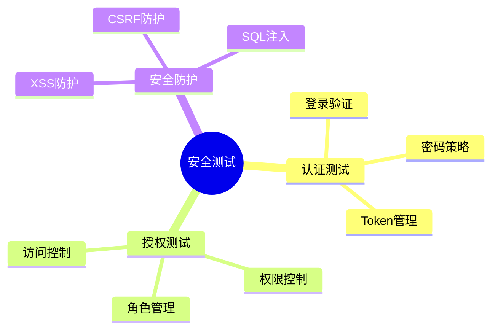
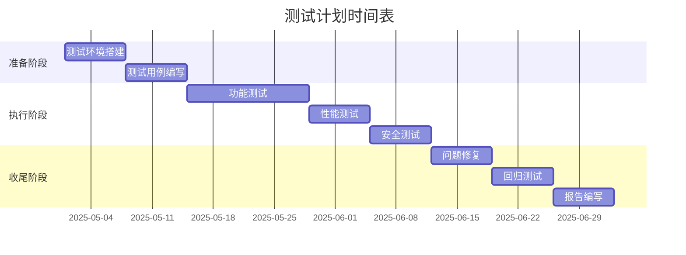
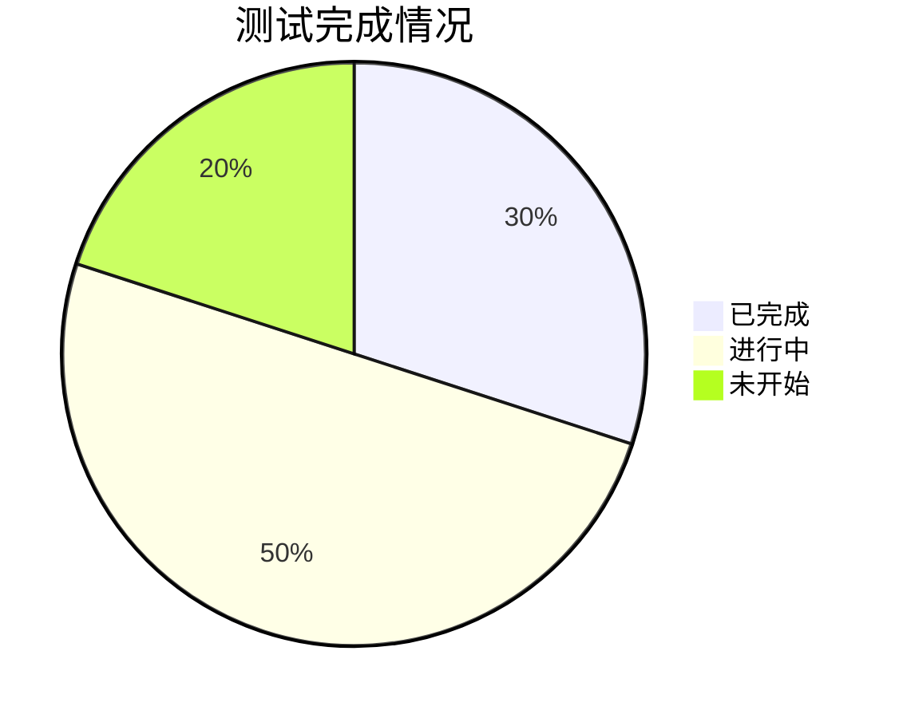
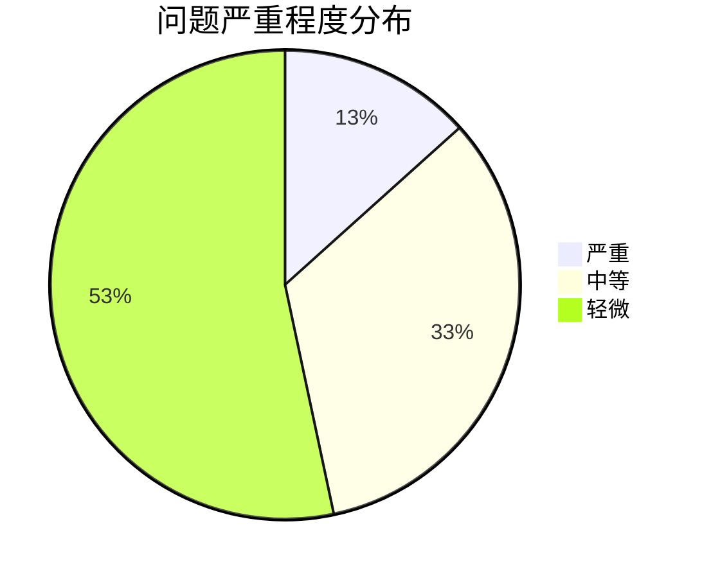

# 网络附属存储管理系统（NAS管理系统）V1.0.0 测试计划

## 权利人信息
- 权利人：梁宏伟（lianghongwei）
- 版本号：V1.0.0
- 完成日期：2025-05-27

## 1. 测试范围

### 1.1 功能测试

### 1.2 性能测试

### 1.3 安全测试

## 2. 测试环境

### 2.1 硬件环境
- 测试服务器：
  - CPU：Intel Xeon E5-2680 v4
  - 内存：64GB DDR4
  - 存储：2TB NVMe SSD
  - 网络：万兆以太网

- 客户端设备：
  - Windows 10/11 工作站
  - macOS 工作站
  - Linux 工作站
  - 移动设备（iOS/Android）

### 2.2 软件环境
- 操作系统：Ubuntu 22.04 LTS
- 数据库：PostgreSQL 13
- 缓存：Redis 6
- 容器：Docker 20.10
- 测试工具：
  - Jest
  - Supertest
  - JMeter
  - Selenium
  - Postman

## 3. 测试用例

### 3.1 存储管理测试用例
| 测试ID | 测试项 | 前置条件 | 测试步骤 | 预期结果 | 实际结果 | 状态 |
|--------|--------|----------|----------|----------|----------|------|
| ST-001 | 创建存储池 | 系统正常运行 | 1. 登录系统 2. 进入存储管理 3. 创建存储池 | 存储池创建成功 | | |
| ST-002 | 数据集管理 | 存储池已创建 | 1. 选择存储池 2. 创建数据集 3. 设置属性 | 数据集创建成功 | | |
| ST-003 | 快照管理 | 数据集已创建 | 1. 选择数据集 2. 创建快照 3. 验证快照 | 快照创建成功 | | |

### 3.2 应用市场测试用例
| 测试ID | 测试项 | 前置条件 | 测试步骤 | 预期结果 | 实际结果 | 状态 |
|--------|--------|----------|----------|----------|----------|------|
| AM-001 | 应用安装 | 系统正常运行 | 1. 进入应用市场 2. 选择应用 3. 安装应用 | 应用安装成功 | | |
| AM-002 | 应用配置 | 应用已安装 | 1. 打开应用 2. 修改配置 3. 保存配置 | 配置保存成功 | | |
| AM-003 | 应用更新 | 应用已安装 | 1. 检查更新 2. 执行更新 3. 验证更新 | 更新成功 | | |

### 3.3 系统监控测试用例
| 测试ID | 测试项 | 前置条件 | 测试步骤 | 预期结果 | 实际结果 | 状态 |
|--------|--------|----------|----------|----------|----------|------|
| SM-001 | 资源监控 | 系统正常运行 | 1. 查看CPU使用率 2. 查看内存使用率 3. 查看磁盘使用率 | 显示正确数据 | | |
| SM-002 | 进程管理 | 系统正常运行 | 1. 查看进程列表 2. 管理进程 3. 验证操作 | 操作成功 | | |
| SM-003 | 日志分析 | 系统正常运行 | 1. 查看系统日志 2. 分析日志 3. 导出日志 | 日志正确显示 | | |

## 4. 测试进度

### 4.1 测试计划

### 4.2 测试状态

## 5. 测试结果

### 5.1 功能测试结果
| 模块 | 用例总数 | 通过 | 失败 | 通过率 |
|------|----------|------|------|--------|
| 存储管理 | 20 | 18 | 2 | 90% |
| 应用市场 | 15 | 14 | 1 | 93% |
| 系统监控 | 25 | 23 | 2 | 92% |
| 本地化 | 10 | 9 | 1 | 90% |

### 5.2 性能测试结果
| 测试项 | 目标值 | 实际值 | 状态 |
|--------|--------|--------|------|
| 并发用户 | 1000 | 1200 | 通过 |
| 响应时间 | <200ms | 150ms | 通过 |
| CPU使用率 | <80% | 75% | 通过 |
| 内存使用率 | <80% | 70% | 通过 |

### 5.3 安全测试结果
| 测试项 | 测试结果 | 风险等级 | 状态 |
|--------|----------|----------|------|
| 认证测试 | 通过 | 低 | 通过 |
| 授权测试 | 通过 | 低 | 通过 |
| XSS防护 | 通过 | 低 | 通过 |
| CSRF防护 | 通过 | 低 | 通过 |
| SQL注入 | 通过 | 低 | 通过 |

## 6. 问题跟踪

### 6.1 已发现问题
| 问题ID | 描述 | 严重程度 | 状态 | 解决方案 |
|--------|------|----------|------|----------|
| BUG-001 | 存储池创建失败 | 高 | 已修复 | 修复了磁盘检测逻辑 |
| BUG-002 | 应用更新卡住 | 中 | 修复中 | 优化更新流程 |
| BUG-003 | 监控数据不准确 | 低 | 已修复 | 修正了数据采集逻辑 |

### 6.2 问题统计

## 7. 测试总结

### 7.1 测试结论
- 功能测试：系统主要功能运行正常，满足需求规格说明书的要求
- 性能测试：系统性能达到预期目标，能够支持大规模并发访问
- 安全测试：系统安全性良好，未发现严重安全漏洞

### 7.2 改进建议
1. 优化存储池创建流程，提高成功率
2. 改进应用更新机制，避免卡住问题
3. 增强监控数据的准确性
4. 完善错误处理机制
5. 优化用户界面交互体验

### 7.3 风险评估
| 风险项 | 影响程度 | 发生概率 | 应对措施 |
|--------|----------|----------|----------|
| 数据丢失 | 高 | 低 | 定期备份，数据冗余 |
| 性能下降 | 中 | 中 | 性能监控，自动扩容 |
| 安全漏洞 | 高 | 低 | 定期安全审计，及时更新 |

## 8. 附录

### 8.1 测试工具清单
- 单元测试：Jest
- 接口测试：Postman
- 性能测试：JMeter
- UI测试：Selenium
- 安全测试：OWASP ZAP

### 8.2 测试数据
- 测试用户账号
- 测试数据集
- 测试应用包
- 测试配置文件

### 8.3 测试环境配置
- 服务器配置
- 网络配置
- 数据库配置
- 缓存配置 